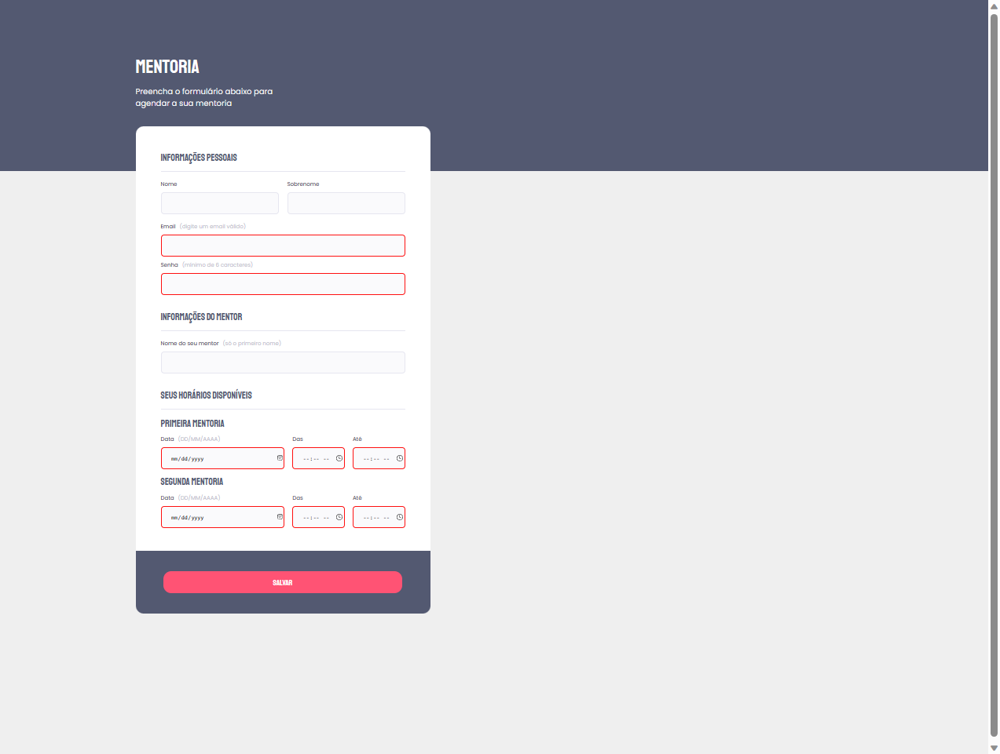

# Formulário Mentoria

## Trilha Explorer 🚀

😎 Desafio do Stage 03 - Formulário intermediário

## 🔰 Tecnologias

- HTML
- CSS
- Git e Github

## 📚 Meu aprendizado

Através das aulas do Stage 03 do curso Explorer da Rocketseat adquiri maiores e fascinantes conhecimentos sobre o HTML e CSS.
Coloquei em prática todos os conhecimentos adquiridos nas aulas nesse desafio para criar um formulário de mentoria.

## 🎯 Contato

https://www.linkedin.com/in/lucascaalazans

e-mail: contato.lucas.calazans@gmail.com
